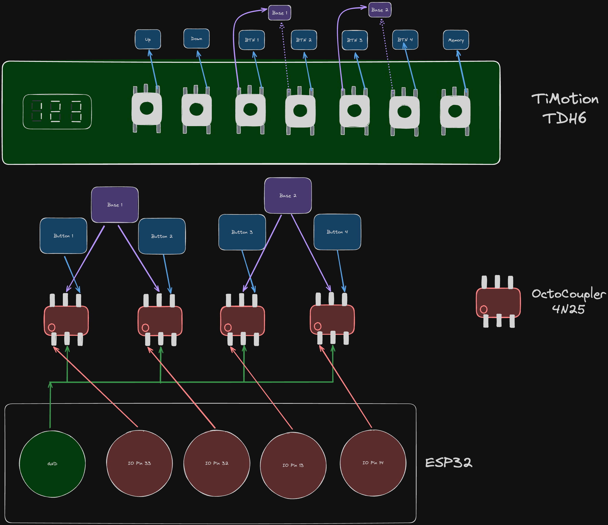

# TiMotion TDH6 Alexa integration

Use an ESP32 to connect a TiMotion TDH6 desk controller to Alexa.

## Desks that use this controller

- GenioDesk Pro

## How to replicate

I'm definitely not a eletrical engineer or hardware guy, so I create this "diagram" in Excalidraw.

### Materials

1. 1 ESP32
2. 1 Fenolite plate at lead 7x9cm
3. 4 OctoCouplers 4N25
4. Around 25 cm of wire
5. Usb cable / Power supply for ESP32
6. Soldering material

## Http Endpoint

Fauxmo exposes this endpoint, so you can control the device using a HTTP POST Request. A body is mandatory,
but the content doesn't matter.

`http://${YOUR_ESP_32_IP}:80/api/devices/lights/${MEMORY_BUTTON_NUMBER}/state/ON`

Using curl:
`curl -X POST http://${YOUR_ESP_32_IP}:80/api/devices/lights/${MEMORY_BUTTON_NUMBER}/state/ON -d 0`
